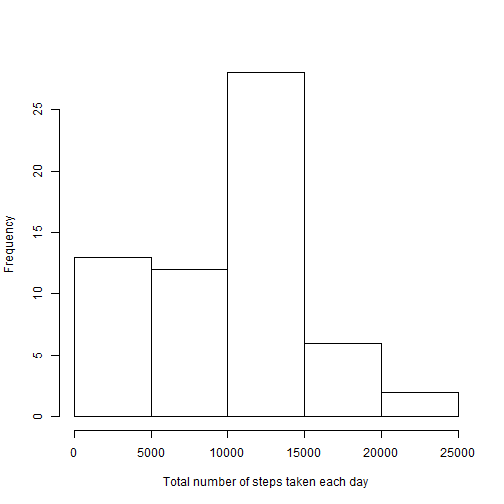
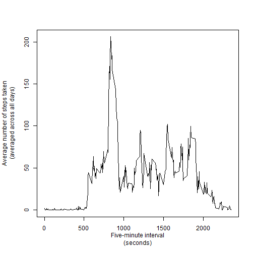
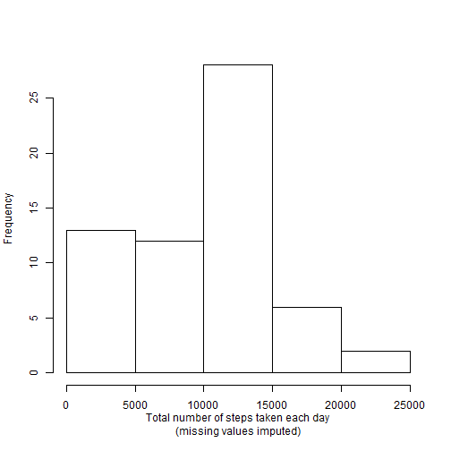
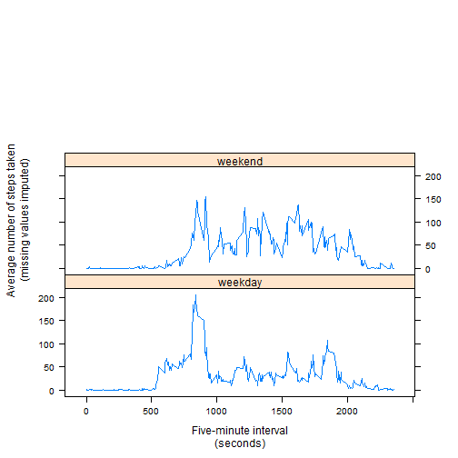

Reproducible Research: Peer Assessment 1
========================================

Author: ChriguK

Date: Monday, August 16, 2015

## Setting global options

```r
library(knitr)
library(dplyr)
library(lubridate)
library(lattice)
opts_chunk$set(echo=TRUE)
old.par <- par(no.readonly = TRUE)

# Set global thousand separator on knitr following
# http://stackoverflow.com/questions/18965637/set-global-thousand-separator-on-knitr
knit_hooks$set(inline = function(x) {
  prettyNum(x, big.mark="'")
})
```

## Loading and preprocessing the data


```r
amd.data <- tbl_df(read.csv(unz("activity.zip", "activity.csv")))
amd.data$date <- ymd(amd.data$date)
```

## What is mean total number of steps taken per day?


```r
steps.per.day <- amd.data %>%
                    group_by(date) %>%
                    summarize(total=sum(steps, na.rm=TRUE)) %>%
                    mutate(group="original")
mean.steps <- round(mean(steps.per.day$total))
median.steps <- round(median(steps.per.day$total))

hist(steps.per.day$total, main="", xlab="Total number of steps taken each day")
```

 

The mean and median of the total number of steps taken per day are **9'354** and **10'395**, respectively.

## What is the average daily activity pattern?


```r
steps.per.interval <- amd.data %>%
                        group_by(interval) %>%
                        summarize(average=mean(steps, na.rm=TRUE))

par(mar=c(5.1, 5.1, 4.1, 2.1))
plot(average~interval, data=steps.per.interval, type='l', xlab="Five-minute interval\n(seconds)", ylab="Average number of steps taken\n(averaged across all days)")
```

 

```r
max.no.interval <- steps.per.interval[steps.per.interval$average==max(steps.per.interval$average), "interval"]
```

The five-minute interval **835**, on average across all the days in the dataset, contains the maximum number of steps. 

## Imputing missing values


```r
no.missing <- sum(!complete.cases(amd.data))
```

The total number of missing values in the dataset is **2'304**.

Missing values were imputed by using the median for the respective 5-minute interval,
calculated from all available data.


```r
median.per.interval <- amd.data %>%
                        group_by(interval) %>%
                        summarize(median=median(steps, na.rm=TRUE))

imputed.steps <- amd.data %>%
                    filter(is.na(steps)) %>%
                    left_join(median.per.interval) %>%
                    select(median)
```


```r
imputed.data <- amd.data
imputed.data$steps[is.na(imputed.data$steps)] <- imputed.steps$median
```


```r
steps.per.day.no.missing <- imputed.data %>%
                                group_by(date) %>%
                                summarize(total=sum(steps)) %>%
                                mutate(group="imputed")
mean.steps.no.missing <- round(mean(steps.per.day.no.missing$total))
median.steps.no.missing <- round(median(steps.per.day.no.missing$total))

hist(steps.per.day.no.missing$total, main="", xlab="Total number of steps taken each day\n(missing values imputed)")
```

 

The mean and median of the total number of steps taken per day are **9'504** and **10'395**, respectively (missing values were imputed).


```r
steps.per.day.comparison <- bind_rows(steps.per.day, steps.per.day.no.missing)
wilcox.test(total~group, data=steps.per.day.comparison)
```

```
## 
## 	Wilcoxon rank sum test with continuity correction
## 
## data:  total by group
## W = 1908.5, p-value = 0.8078
## alternative hypothesis: true location shift is not equal to 0
```

According to a Mann-Whitney test, the original values (with missing values) do not differ significantly from the values with imputed data (without missing values).

Imputing missing data did increase the mean of the total number of steps by 1.6%. The median of the total number of steps was, however, not affected.

## Are there differences in activity patterns between weekdays and weekends?


```r
imputed.data <- imputed.data %>%
                    mutate(day.of.week = ifelse(grepl('^S', weekdays(amd.data$date), ignore.case=T), "weekend", "weekday"))
```


```r
steps.per.interval.weekday <- imputed.data %>%
                                group_by(interval, day.of.week) %>%
                                summarize(average=mean(steps))
xyplot(average~interval|day.of.week, data=steps.per.interval.weekday, type='l', layout=c(1,3), xlab="Five-minute interval\n(seconds)", ylab="Average number of steps taken\n(missing values imputed)")
```

 
